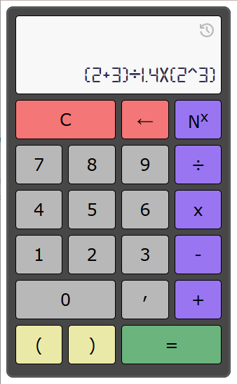
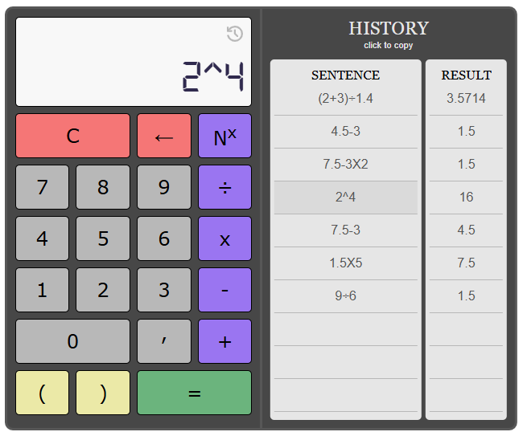

# 🧩 Projeto: Calculadora Científica Básica

https://glaubercarlos.github.io/CalculadoraCientifica/

## 🔎 Introdução

Criei esta calculadora com o objetivo de sair do básico "variável + variável = resultado" e obter mais flexibilidade nas operações matemáticas.

Ela permite montar sentenças longas, utilizar parênteses e realizar operações de adição, subtração, multiplicação, divisão e potenciação.

## 📐 Features

Como recursos adicionais, posso mencionar o botão de apagar caractere, útil caso o usuário erre ao digitar a sentença, e o histórico, que possibilita visualizar operações e resultados anteriores, além de reutilizar uma sentença ou resultado ao clicar sobre ele.

---

## ⚙️ Funcionamento

O projeto foi desenvolvido utilizando HTML, CSS e JavaScript.

#### ▶️ HTML
Utiliza HTML simples, com classes, ids e semântica tradicional. Os botões (teclas) possuem o atributo data-value, responsável por transmitir corretamente os valores ao script.

#### ▶️ CSS
Conta com estilização básica, uso de Grid para posicionar os botões, @font-face, efeitos de hover e @media queries, garantindo uma responsividade simples para dispositivos móveis.

#### ▶️ Javascript
O coração do projeto está aqui. Há a manipulação do DOM, loops, controle de responsividade no tamanho da fonte, funções e eventListeners.

📌 O fluxo de funcionamento do script é o seguinte:

💠 O usuário seleciona números e operadores para montar a sentença.

💠 Os operadores são convertidos internamente para exibir ao usuário símbolos como "÷" e "x", em vez de "/" e "*", por exemplo.

💠 Toda a expressão é armazenada como string em uma variável.

💠 Ao clicar em "=", inicia-se uma sequência de funções.

🔸 1º - Tokenizer Manual

A sentença é transformada em um array de tokens. Há um trabalho cuidadoso de validações para diferenciar números negativos de operadores negativos, bem como para tratar corretamente números decimais.

Ex: a sentença:

<b>-(-2x1.5)÷3^2</b> 

é convertida em:

<b>['0', '-', '(', '-2', '*', '1.5', ')', '/', '3', '^', '2']</b>

(O valor '0' é adicionado para manter a lógica do número negativo, por exemplo: "0-1 = -1").

🔸 2º - Algoritmo Shunting Yard

Utiliza-se o algoritmo Shunting Yard, criado para reorganizar os elementos da expressão em uma forma que permita a avaliação correta posteriormente.

Para isso, o algoritmo percorre os tokens utilizando duas pilhas e aplica regras de precedência com base em “pesos” definidos para cada operador.

Ex: o array:

<b>['0', '-', '(', '-2', '\*', '1.5', ')', '/', '3', '^', '2']</b> 

é convertido em:

<b>['0', '-2', '1.5', '*', '3', '2', '^', '/', '-']</b>

Respeitando a prioridade dos parênteses.

🔸 3º - Cálculo da Expressão

Após a definição da ordem de precedência, a expressão é calculada utilizando uma pilha, processando os valores de dois em dois conforme os operadores encontrados.

🔸 4º - Exibição do Resultado

O resultado final é exibido na tela e salvo no histórico, com arredondamento de até 4 casas decimais, evitando imprecisões comuns em cálculos com ponto flutuante.

## 📝 Considerações

Foi um projeto muito proveitoso de desenvolver. Exigiu estudo sobre o algoritmo Shunting Yard, manipulação de duas pilhas, uso intensivo de forEach, além de diversos controles de erro e validações de sintaxe.

Melhorias ainda estão por definir.